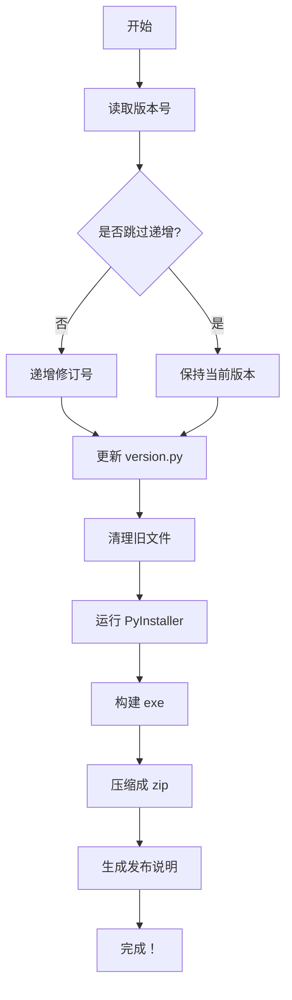

# ? 自动打包和发布系统 - 实现完成

## 功能总结

你的项目现已实现 **完整的自动化打包、版本管理和发布系统**！

### ? 已实现功能

| 功能 | 状态 | 说明 |
|------|------|------|
| **自动版本管理** | ? | 每次打包自动递增版本号（修订号+1） |
| **exe 构建** | ? | 使用 PyInstaller 构建单个可执行文件（~47MB） |
| **打包压缩** | ? | 自动打包成 zip 文件（带版本后缀） |
| **发布管理** | ? | 所有版本自动保存到 `release/` 目录 |
| **版本追踪** | ? | 每个版本生成发布说明文件 |
| **一键发布** | ? | 支持 PowerShell、批处理、快捷脚本 |

## 快速使用

### ? 一键打包（三选一）

**选项 1：PowerShell（推荐）**
```powershell
cd "c:\Users\Lemon\Documents\编程卡上位机"
powershell -ExecutionPolicy Bypass -File "scripts\build_and_release.ps1"
```

**选项 2：批处理（Windows 用户）**
```
双击运行：scripts\release.bat
```

**选项 3：快捷脚本**
```powershell
powershell -ExecutionPolicy Bypass -File "scripts\release.ps1"
```

### ? 输出文件

每次打包会在 `release/` 目录生成：

- ? `UsartGUI_v2.0.3.zip` - 应用包（包含 exe + config）
- ? `v2.0.3_RELEASE_NOTES.txt` - 发布说明

## 文件结构

```
编程卡上位机/
├── scripts/
│   ├── build_and_release.ps1      # ? 核心打包脚本
│   ├── release.ps1                # 快捷启动器
│   ├── release.bat                # 批处理启动器
│   └── run.ps1                    # 运行脚本
│
├── release/                        # ? 发布目录
│   ├── UsartGUI_v2.0.2.zip
│   ├── UsartGUI_v2.0.3.zip
│   ├── v2.0.2_RELEASE_NOTES.txt
│   ├── v2.0.3_RELEASE_NOTES.txt
│   ├── README.md
│   ├── BUILD_AND_RELEASE_GUIDE.md
│   └── ...（所有历史版本）
│
├── version.py                      # ? 版本号文件
├── build_config.ini               # 构建配置（可选）
└── ...（其他项目文件）
```

## 版本管理

### 当前版本

```python
# version.py
__version__ = "2.0.3"
```

### 版本自增规则

- **修订号自动递增**：每次打包时 Z 部分自动 +1（2.0.3 → 2.0.4）
- **主次版本手动修改**：编辑 `version.py` 中的 X 或 Y 部分

### 示例流程

```
打包 1：
  version.py: 2.0.0
  输出：UsartGUI_v2.0.0.zip
  
打包 2：
  自动更新：2.0.0 → 2.0.1
  version.py: 2.0.1
  输出：UsartGUI_v2.0.1.zip
  
手动修改（如需要）：
  编辑 version.py: 3.0.0
  
打包 3：
  自动更新：3.0.0 → 3.0.1
  version.py: 3.0.1
  输出：UsartGUI_v3.0.1.zip
```

## 脚本工作流程



## 脚本参数

```powershell
# 默认（推荐）
.\scripts\build_and_release.ps1

# 跳过版本递增（测试用）
.\scripts\build_and_release.ps1 -SkipVersionIncrement

# 打成文件夹（不推荐）
.\scripts\build_and_release.ps1 -OneFile $false
```

## 关键特性

### 1?? 自动版本递增
```python
当前版本：2.0.3
执行打包后自动变为：2.0.4
无需手动修改
```

### 2?? 完整的发布包
```
UsartGUI_v2.0.3.zip 包含：
├── UsartGUI.exe         # 主程序
└── config/              # 所有配置文件
```

### 3?? 版本追踪
```
release/ 目录保留所有历史版本
可随时回滚到任何版本
```

### 4?? 自动生成发布说明
```
v2.0.3_RELEASE_NOTES.txt
├── 版本号
├── 发布时间
├── 文件大小
└── 安装说明
```

## 构建时间

| 步骤 | 耗时 |
|-----|------|
| 版本处理 | < 1s |
| 清理旧文件 | < 2s |
| PyInstaller 编译 | 30-60s |
| 压缩 zip | 10-20s |
| **总计** | **~1-2 分钟** |

## 常见问题

### Q: 我可以跳过版本递增吗？
**A:** 可以，使用 `-SkipVersionIncrement` 参数（仅用于测试）

### Q: 如何修改发布说明？
**A:** 编辑 `scripts/build_and_release.ps1` 的第 5 步中的 `$releaseInfo` 变量

### Q: 如何分发给用户？
**A:** 直接分享 `release/UsartGUI_v*.zip` 文件，用户只需解压后运行 exe

### Q: 如何回滚到旧版本？
**A:** `release/` 目录保留所有版本，直接使用对应的 zip 文件

### Q: 脚本出错怎么办？
**A:** 检查以下几点：
1. 确保在项目根目录运行
2. 确保 Python 已安装（`python --version`）
3. 确保 PyInstaller 已安装（`pip install pyinstaller`）
4. 删除 `build/` 和 `dist/` 目录后重试

## 相关文档

- ? [BUILD_AND_RELEASE_GUIDE.md](release/BUILD_AND_RELEASE_GUIDE.md) - 详细使用指南
- ? [PERFORMANCE_FIX.md](PERFORMANCE_FIX.md) - 性能优化说明
- ?? [build_config.ini](build_config.ini) - 构建配置文件

## 项目成果

? **完成内容**：
1. ? 自动化构建系统（PyInstaller）
2. ? 版本号自动管理和递增
3. ? 自动打包成 zip（带版本后缀）
4. ? 发布目录管理（保留历史版本）
5. ? 一键发布脚本（3 种启动方式）
6. ? 完整文档和使用指南
7. ? 内存泄漏修复（之前完成）

## 下一步建议

1. **创建发布日志** - 更新每个版本的 CHANGELOG
2. **配置 CI/CD** - 集成到 GitHub Actions（可选）
3. **定期备份** - 将稳定版本单独备份
4. **用户测试** - 在发布前进行充分测试

## 支持和帮助

遇到问题？检查以下资源：
- 详细指南：[BUILD_AND_RELEASE_GUIDE.md](release/BUILD_AND_RELEASE_GUIDE.md)
- 脚本源码：[scripts/build_and_release.ps1](scripts/build_and_release.ps1)
- 构建配置：[build_config.ini](build_config.ini)

---

**祝你使用愉快！?**

当你需要发布新版本时，只需运行：
```powershell
powershell -ExecutionPolicy Bypass -File "scripts\build_and_release.ps1"
```

系统会自动处理所有细节！
